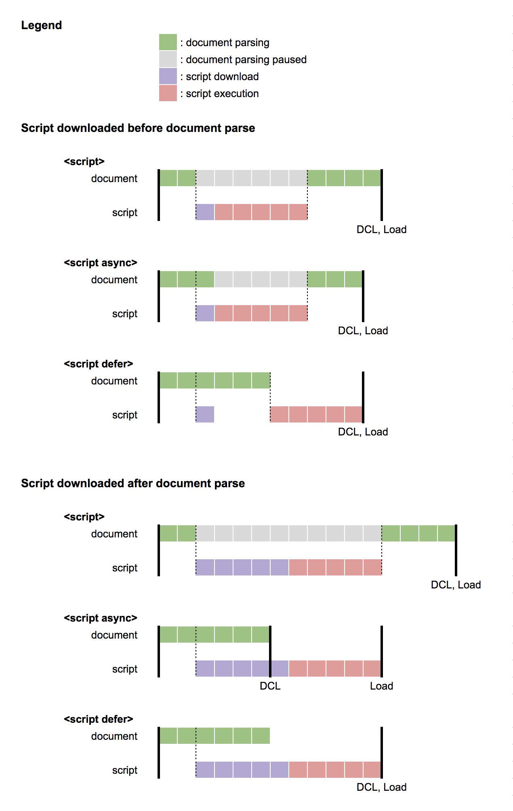

# async-defer-example

> Example for async/defer attribute for external scripts



## Development
``` bash
# install dependencies
yarn

# serve with hot reload
yarn dev
```

### Pseudo script
```
<script src="script.js?d=5&l=10"></script>
```
#### Parameters
| Name | Description |
| ---- | ---- |
| d | Delay script download time (sec) |
| l | For-loops count (l * 100000000) |

## References
* https://flaviocopes.com/javascript-async-defer/#the-position-matters
* http://www.growingwiththeweb.com/2014/02/async-vs-defer-attributes.html
* https://qiita.com/mamo/items/ff336b5cc0a1a95e03a7
